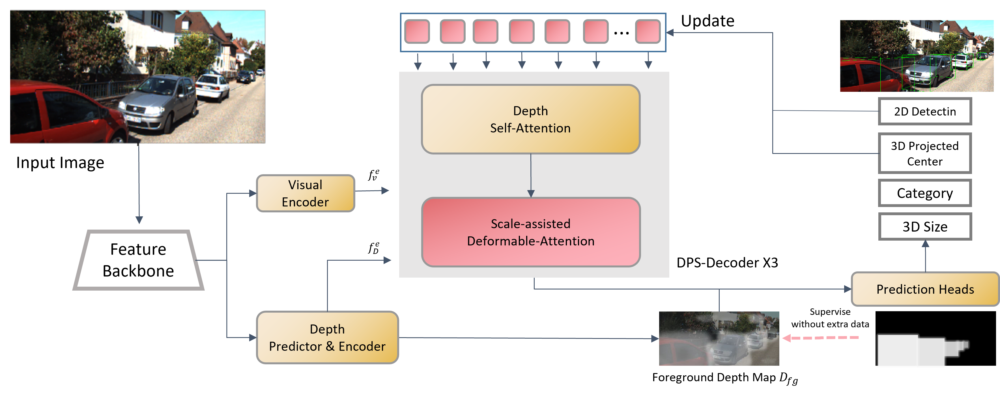

# MonoPSTR: Monocular 3D Object Detection with Dynamic Position&Scale-aware Transformer

https://youtu.be/_Rr3cM39XYo

## Introduction
We present MonoPSTR, which employs a dynamic Position&Scale-aware TRansformer for Monocular 3D detection. Our approach introduces a Dynamically and Explicitly Position-coded query(DEP-query) and a Scale-assisted Deformable Attention (SDA) module to help the raw query possess valuable spatial and content cues. Specifically, the DEP-query employs explicit position priors of 3D projection coordinates to enhance the accuracy of query localization, thereby enabling the attention layers in the decoder to avoid noisy background information. The SDA module optimizes the receptive field learning of queries by the size priors of the corresponding 2D boxes, thus the queries could acquire high-quality visual features. Both the position and size priors do not require any additional data and are updated in each layer of the decoder to provide long-term assistance.
<div align="center">
  
</div>

## Installation
1. Clone this project and create a conda environment:
    ```
    git clone https://github.com/yangfan293/MonoPSTR.git
    cd MonoPSTR

    conda create -n monopstr python=3.8
    conda activate monopstr
    ```
    
2. Install pytorch and torchvision matching your CUDA version:
    ```bash
    conda install pytorch torchvision cudatoolkit
    ```
    
3. Install requirements and compile the deformable attention:
    ```
    pip install -r requirements.txt

    cd lib/models/monopstr/ops/
    bash make.sh
    
    cd ../../../..
    ```
    
4. Make dictionary for saving training losses:
    ```
    mkdir logs
    ```
 
5. You shoud download the KITTI, Waymo datasets, and follow the OpenPCDet(https://github.com/open-mmlab/OpenPCDet) to generate data infos.
   You can also change the data path at "dataset/root_dir" in `configs/monopstr_kitti.yaml` and `configs/monopstr_waymo.yaml`
    
## Get Started (We take the example on KITTI, follow the DEVIANT to further process the Waymo dataset.)

### Train
You can modify the settings of models and training in `configs/monopstr_kitti.yaml` and indicate the GPU in `train.sh`:

    bash train.sh configs/monopstr_kitti.yaml > logs/monopstr_kitti.log
   
### Test
The best checkpoint will be evaluated as default. You can change it at "tester/checkpoint" in `configs/monopstr_kitti.yaml`:

    bash test.sh configs/monopstr_kitti.yaml


## Acknowlegment
This repo benefits from the excellent [MonoDETR](https://github.com/ZrrSkywalker/MonoDETR) and [DEVIANT](https://github.com/abhi1kumar/DEVIANT).


## Contact
If you have any questions about this project, please feel free to contact ysyf293@hun.edu.cn.
